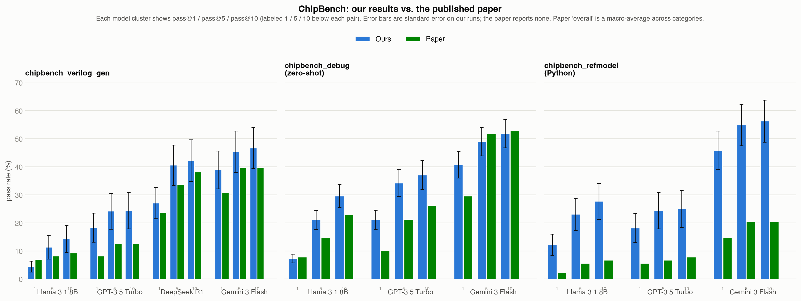
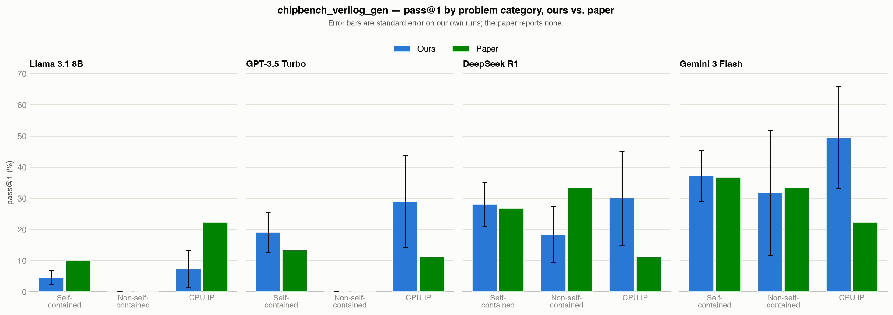
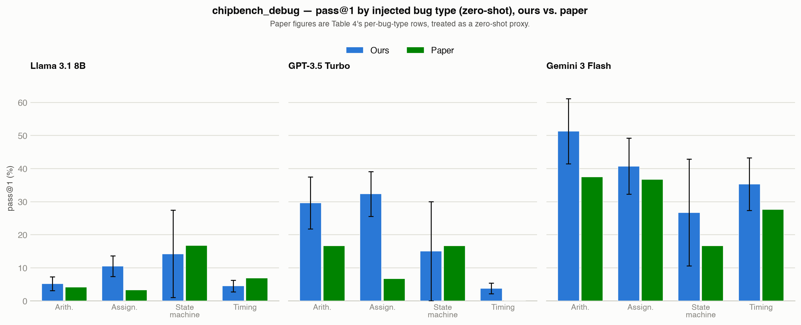
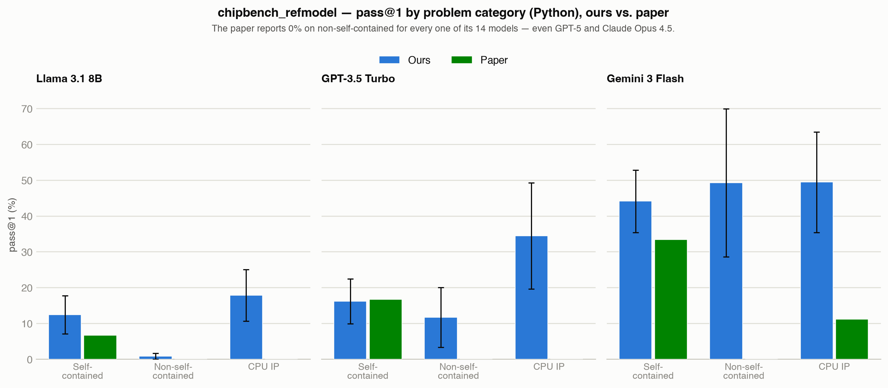
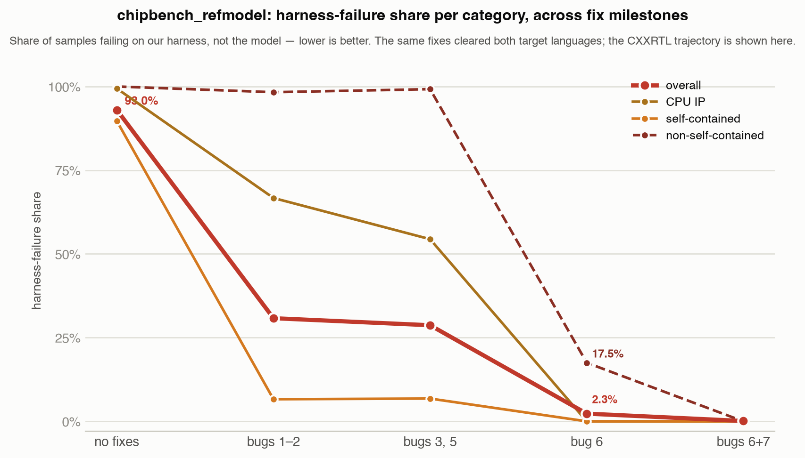

# Porting ChipBench to Inspect AI Revealed Seven Evaluation-Harness Bugs

**What it measures:** whether LLMs can write, debug, and model digital hardware (Verilog) —
correctness is checked by real circuit simulation, not by comparing text.
**Paper:** [arXiv:2601.21448](https://arxiv.org/abs/2601.21448) · **Original code:**
[github.com/zhongkaiyu/ChipBench](https://github.com/zhongkaiyu/ChipBench)

*Unfamiliar term? This post uses some hardware-design vocabulary (RTL, CXXRTL, golden reference, …)
and some Inspect/eval vocabulary (pass@k, evaluation harness, sandbox, …) that not every reader will
have both halves of. See [`docs/glossary.html`](docs/glossary.html) for one-line definitions of
everything used here, from either side.*

## Abstract

Recursive AI development may depend not only on increasingly autonomous software research but also on progress through hardware-design bottlenecks. Evaluating model capabilities in these areas is therefore important for assessing the pace and risks of recursive capability improvement. We port ChipBench—covering Verilog generation, debugging, and cross-language reference-model generation—to the Inspect Evals framework, validate its evaluation harness, and compare results across Llama 3.1 8B, GPT-3.5 Turbo, and Gemini 3 flash. During this process, we identify several bugs in the `chipbench_refmodel` pipeline affecting approximately 40 of 90 problems, causing model outputs to be incorrectly marked as failures because of errors in the evaluation infrastructure. Fixing these bugs reduces the harness-failure rate from 43–93% to approximately 2% in the affected categories and increases pass@1 by more than 10 percentage points for some models. These results show that harness failures can systematically produce false-negative labels, underestimate model capabilities, and potentially distort conclusions drawn from other tool-based benchmarks.

**Status:** all three tasks (`chipbench_verilog_gen`, `chipbench_debug`, `chipbench_refmodel`)
implemented, tested (60 unit/e2e tests, full pipeline validated against a real Docker toolchain),
and reproduced against two to three models each. Seven known infrastructure bugs are fixed and regression-tested. Submitted to the [Inspect Evals Register](https://github.com/UKGovernmentBEIS/inspect_evals/blob/main/EVAL_REGISTER.md).

  

## Why this benchmark

Existing Verilog benchmarks are largely saturated — state-of-the-art models exceed 95% pass rates on them, and their problems (10-76 lines of code, no submodules) look nothing like real industrial chip design. ChipBench's problems are ~4x longer and ~14x more complex by cell count, and the best model in the original paper (Claude Opus 4.5) solves only 30.7% of its Verilog generation problems on the first attempt. It also uniquely covers two capabilities existing benchmarks skip entirely: **fixing bugs** in existing Verilog, and **generating reference models** in other languages (Python/C++) that industrial verification teams use to cross-check hardware designs before manufacturing.

  
## What we built

An Inspect AI implementation covering all three of ChipBench's tasks:
- **`chipbench_verilog_gen`** — write a Verilog module from a specification.
- **`chipbench_debug`** — fix an injected bug (arithmetic, assignment, timing, or state-machine)
in an existing module, with or without a waveform trace to help.
- **`chipbench_refmodel`** — write a functionally equivalent Python or C++ model of a Verilog
module.

The key design principle carried over from the original benchmark: every submission is compiled and simulated against a trusted "golden" reference implementation, driving the same test inputs into both and checking that their outputs agree — cycle by cycle, for hundreds of test vectors. A model could write completely different-looking code from the reference and still score correctly, as long as it behaves identically under tests. The whole pipeline runs inside an isolated, purpose-built toolchain (Icarus Verilog, Verilator, and Yosys) so that untrusted, LLM-generated code never executes directly on the host machine.

## Results vs. the published paper

We ran this benchmark against models spanning small-open to frontier — Llama&nbsp;3.1&nbsp;8B,
GPT-3.5&nbsp;Turbo, and Gemini&nbsp;3&nbsp;Flash on all three tasks, plus DeepSeek&nbsp;R1 on Verilog
generation — and compared every task against the numbers in the original paper (which itself reports
14 models, so several of ours have a direct paper baseline). The point of the exercise is validation:
if the Inspect port faithfully reproduces the benchmark, our numbers should track the paper's, and
where they *don't*, the divergence should be explainable rather than mysterious. Throughout, our own
figures are shown as **mean(stderr)** — a 4.44% pass rate with a ±1.94-point standard error, say —
while the paper reports point estimates with no error bars.

The high-level picture, across all three tasks and all pass@k thresholds for multiple models:

We evaluate the accuracy over 3 tasks against a small open source model llama 3.1 8b, a medium tier model GPT 3.5 Turbo and a frontier model Gemini 3 flash. Across different models, the benchmark accuracy does increase with general model capability. Notably, compared with the paper, our evaluation shows higher accuracies consistently across all models in all 3 tasks, with an exceptionally higher pass rate in task 3. While for task 1 and 2 we utilized the exactly same evaluation harness, several bugs were identified in the task 3 evaluation pipeline from the original paper's repositiory. After debugging the harness iteratively, we removed all pipeline-related failures; and the accuracy increased dramatically across all models. We elaborate each task in the following subsections with a task description, the detailed sub-tasks performance comparison; specifically, after the chipbench_refmodel task section, we elaborate how we debug the evaluation with ab iterativly developed failure classifier. 

### `chipbench_verilog_gen`

**The task.** Given a natural-language module specification, the model writes a Verilog
implementation, scored by compiling it against the golden reference's testbench in Icarus Verilog and
comparing outputs cycle-by-cycle.

The single cleanest reproduction in this whole study lives in the middle bar of every panel:
**non-self-contained (hierarchical) designs.** The two weaker models, Llama&nbsp;3.1&nbsp;8B and
GPT-3.5&nbsp;Turbo, reproduce the paper's flat 0% exactly — neither solves a single hierarchical
problem, matching the paper's claim that smaller models can't yet assemble multi-module designs. The
two strong models are the informative contrast: DeepSeek&nbsp;R1 (18.3% pass@1, 50% pass@10) and
Gemini&nbsp;3&nbsp;Flash (31.7% pass@1) both *can* do them, and both land close to the paper's own
figures for those exact models — DeepSeek's pass@10 matches at 50%, and Gemini's 31.7% sits right on
the paper's 33.3%. So the 0% is a capability floor for weak models, not an artifact of the task; and
where a model clears that floor, our numbers track the paper's.

The one consistent *divergence* is CPU IP components, and it's worth stating precisely rather than as
a blanket claim. Three of the four models — DeepSeek, GPT-3.5, and Gemini — score roughly 2–3× the
paper there (Gemini 49.4% vs. 22.2%), while Llama alone scores *lower* than the paper at pass@1 (7.2%
vs. 22.2%) before converging to its exact figure by pass@10. So it isn't "we score everyone higher";
it's a category-specific gap that now recurs across three unrelated models spanning mid-tier to
frontier, which makes it look structural — worth a targeted look — rather than sampling noise.

### `chipbench_debug`

**The task.** Given a Verilog module with one injected bug — arithmetic, assignment, timing, or
state-machine — optionally alongside a waveform trace of the buggy behavior, the model produces a fix,
scored the same way via Icarus Verilog simulation against the golden reference.

Here the reproduction is looser, and honestly so: the paper's Table&nbsp;4 doesn't state whether it
reports zero-shot, one-shot, or a blend, so we treat it as a zero-shot proxy rather than a confirmed
match. The ordering by capability is clean — Gemini&nbsp;3&nbsp;Flash is the strongest debugger (40.8%
pass@1, above the paper on every bug type), GPT-3.5 sits in the middle (21.1% vs. the paper's 10.0%),
and Llama is weakest, landing almost exactly on the paper at pass@1 (7.36% vs. 7.77%). The gap between
our numbers and the paper's is mostly a pass@1 effect, though: by pass@5/pass@10 Gemini's paper
figures (51.8% / 52.8%) essentially match ours (49.0% / 51.9%). No single bug type reproduces as
tightly as verilog_gen's hierarchical category did — the closest is state-machine, which is also the
smallest and noisiest bucket (only 6 problems, hence the wide error bars).

The more interesting sub-question this task can answer directly is whether *showing the model a
waveform of the buggy behavior actually helps* — the paper reports "mixed performance" across its
model set without per-model detail. For Llama, adding the trace (one-shot) is a small net improvement
in aggregate that hides a genuine split by bug type: arithmetic, assignment, and timing all improve,
while state-machine gets worse. That echoes the paper's mixed finding at the level of an individual
model rather than contradicting it — waveform data helps on some bug classes and not others, and not
reliably enough to call an unambiguous win. (GPT-3.5 can't run one-shot at all: a full waveform trace
plus prompt overflows its 16K-token context window — a model limitation, not a harness one.)

### `chipbench_refmodel`

**The task.** Given a Verilog module, the model writes a functionally-equivalent reference model in
Python or C++ (CXXRTL), scored by a Verilator-based cross-language differential test that drives
identical inputs into both and checks that the outputs agree.

This is where the comparison gets genuinely interesting — and where the numbers only became
trustworthy after the substantial debugging effort described in the next section. Self-contained
modules track the paper reasonably closely for all three models (Gemini 44.1% vs. the paper's 33.3%,
Llama and GPT-3.5 in line too). But look at the middle bar of each panel: **the paper reports a flat
0% on non-self-contained for every one of the fourteen models it evaluated — not just the weak ones,
but GPT-5 and Claude Opus 4.5 too — while our fixed harness gets Gemini 3 Flash to 49%.** CPU IP tells
the same story a shade more mildly: the paper records 0–11% for every model, where our harness scores
several times higher (Gemini 49.4% vs. 11.1%).

That a *frontier* model scores a flat zero on an entire category — in a paper where no model of any
strength, GPT-5 and Claude Opus included, scores above zero there — is the single hardest fact to
explain as a capability limit. The far more likely reading, given what we found getting this task to
run at all, is that **the paper's own harness contains a bug that blocked the category before the
model was ever measured**: we independently found and fixed exactly such a bug in our own port (a
missing-submodule-staging gap that guarantees a 0% regardless of model quality). This stays a
specific, falsifiable hypothesis rather than a confirmed finding — the paper never shipped a runnable
reference-model harness for us to test directly — but a whole column of zeros spanning fourteen models
from Llama 8B to GPT-5 reframes the paper's "no current model can do this" from a capability claim
into a probable tooling artifact, exactly the kind of thing an honest re-implementation exists to
catch. (CXXRTL was also run for the two original models; the paper publishes no CXXRTL baseline to
compare against.)

## Debugging the evaluation

The refmodel numbers above look unremarkable until you know what they cost. On the very first runs,
most of `chipbench_refmodel` wasn't measuring the model at all — it was measuring our own scoring
harness, which was failing before the model's answer ever got a fair test. Separating those two kinds
of failure — a **capability failure** (the model wrote wrong code) from a **pipeline failure** (the
harness couldn't correctly score *any* code) — turned out to be the central technical problem of the
whole project, and the part most worth carrying to other benchmarks.

Getting a clean signal out of this task took finding and fixing **seven such harness bugs**, and it
is worth stating up front whose they are: **five of the seven are defects in the paper's own shipped
code and data** — a testbench generator that references a clock for combinational circuits, a port
extractor that mis-parses parametrized bit-widths, a clock-detection helper that only checks a
module's *first* input, a golden reference Verilator rejects outright, and reference files using
macros defined only in a separate file — each confirmed with a byte-for-byte `diff` against a mirror
of the original ChipBench repository before being attributed to anyone. Those fire for anyone who
runs the paper's own toolbox, not just this port. The remaining two are genuinely ours and flagged
just as explicitly: a submodule-staging gap in the reference-model dataset we had to *construct* (the
paper never ships a runnable one), and a prompt/toolchain-version mismatch from pinning a specific
Yosys build. That accounting is what lets us later suggest the paper's own flat 0% on some categories
is likely a harness artifact and mean it responsibly — we only call a bug the paper's when a `diff`
proves it.

### Harness failure trajectory

The number we actually drove down isn't a pass rate — it's the share of every sample's failure that
traces to the harness rather than the model. Every point still in that "pipeline" band is a sample
that never measured the model at all, so its contribution to the pass rate is meaningless. Watching
that share fall is how we knew a fix had genuinely worked:

On the original CXXRTL runs, **93% of samples were failing on the harness, not the model** — a pass
rate computed over that is very nearly pure noise. Each line above is one problem category; each
milestone on the x-axis is a fixed bug or pair of bugs. The overall share (red) drops from 93% to
~31% once an outdated CXXRTL prompt and a missing submodule are staged correctly, then to ~2% after a
rewrite of a vendored port-extraction script — by which point self-contained and CPU IP are already
fully clean. Only non-self-contained (dashed) stays pinned near 100% far longer, because a single CPU
problem in it was blocked by two further bugs in a row; it finally reaches 0 at the last milestone
once both are fixed. Every bug on this trajectory affects both target languages, not just CXXRTL —
the Python runs followed the same shape from a lower starting share (~31%). The finer-grained
version — every run in order, each pipeline bucket mapped to the exact bug that causes it — lives in
[`debug_report.html`](debug_report.html); the shape is the whole point, harness failures going from
dominating the signal to absent.

### The failure classifier

We couldn't have driven that number down without being able to *measure* it, sample by sample — and
both ChipBench scorers hand back only free-text tool output (a compiler log, a simulator dump), not
structured error codes. So the core instrument of this project was a **failure classifier**: a script
that reads every sample's raw error text across every run (via Inspect's own `samples_df`) and sorts
it into buckets — pass, capability failure, pipeline failure — with each pipeline bucket tied to the
specific bug that produces it.

Crucially, it was **bootstrapped iteratively, not designed up front.** Each sample's error text is
matched against a growing cascade of regex signatures, each one added only after a real failure was
read by hand and traced to a confirmed root cause. Anything matching nothing falls into an explicit
"unclassified" bucket — and it was that leftover bucket, not the categories already believed clean,
that kept surfacing the next bug.

The loop in the diagram above is meant to run *again every time a fix lands*, and this project is the
argument for why. Four separate times, fixing one bug didn't shrink the failure count the way it
should have — it just exposed a second bug that had been sitting underneath the first, invisible
because a compiler only reports its first error per file. The most recent instance was live: fixing a
Verilator-strictness bug on one CPU problem made it finally compile, which immediately revealed a
*second* harness bug on the same problem (a clock-detection helper that only ever checked a module's
first input) — caught only because the "manually inspect the leftovers" step was actually re-run
rather than the category being marked done once its known error signature disappeared. The exact
masking relationships and before/after counts are tabulated in
[`debug_report.html`](debug_report.html); the transferable lesson is a single sentence: **a failure
bucket dropping to zero is the trigger to re-inspect what's left, not the signal to stop looking.**

How far this approach travels depends on one property of the scorer: it has to expose verbose,
greppable failure text, and its failures have to cluster into a small number of recurring causes.
That holds for anything scored by a compiler or a simulator. It holds much less well for an
LLM-judged or rubric-scored eval, where a "failure" is a judgment call with no crisp error string to
match on — there, the classification step would itself have to become model-based, quietly
reintroducing the very "who validates the validator" problem this whole exercise was built to escape.

## Conclusion

This project ported all three ChipBench tasks — Verilog generation, debugging, and cross-language
reference-model generation — into Inspect AI, validated that the scoring harness can't be fooled by
a plausible-looking wrong answer, and reproduced several of the original paper's broad performance
patterns across three models (Llama 3.1 8B, GPT-3.5 Turbo, DeepSeek R1) — close agreement on some
categories, substantial and honestly-reported discrepancies on others, not a uniform match. Along
the way we found and fixed **seven bugs in the evaluation harness itself**, each of which had been
silently producing clean-looking, near-0% scores that had nothing to do with model capability;
fixing them dropped the harness's own pipeline-failure share from 43–93% down to ~2% on the
affected categories and measurably raised pass rates for every model re-tested against the fixed
pipeline. The seventh turned up while reconfirming the sixth fix (see the `chipbench_refmodel`
results above) — a live demonstration of this document's own thesis, confirmed present in the
paper's own unmodified code and fixed the same day. One genuinely broken dataset record (a
self-contradictory `chipbench_refmodel`
prompt) was also identified and excluded. The implementation is tested, reproduced against
two-to-three models per task, and submitted to the [Inspect Evals
Register](https://github.com/UKGovernmentBEIS/inspect_evals/blob/main/EVAL_REGISTER.md).

The next step is to test whether the same failure-classification workflow improves other
tool-grounded evaluations, beginning with physical-design benchmarks — ChipBench's RTL-level focus
(specification → Verilog → reference model) is only the first stage of the hardware design
pipeline, and further stages (place-and-route, physical verification) lean on EDA tool loops with
their own harness-failure surface to get wrong. The broader goal is not merely to make benchmarks
run, but to establish that their failures genuinely measure the model rather than the surrounding
infrastructure.

**Related benchmarks:** [PDAgent-Bench](https://arxiv.org/html/2606.17253v1) (LLM/VLM agents
against real EDA tool loops for physical design) and [HardSecBench](https://arxiv.org/pdf/2601.13864)
(hardware security awareness, a natural pairing with `chipbench_debug`'s bug-fixing task).

## Appendix: full result tables

The exact numbers behind the charts in the Results section. Our figures are **mean(stderr)** to 3
significant figures; the paper reports point estimates with no error bars (shown after the `/`).
Gemini 3 Flash is in the paper (Tables 2–4); all our Gemini runs are 20 epochs. One caveat on the
overall tables: the paper's overall is a **macro-average across categories** (the unweighted mean of
the three per-category rates), whereas our overall is problem-weighted — so the per-category rows are
the cleanest like-for-like comparison.

### `chipbench_verilog_gen`

| Model | pass@1 (ours / paper) | pass@5 (ours / paper) | pass@10 (ours / paper) |
|---|---|---|---|
| Llama 3.1 8B | 4.44(1.94)% / 7.0% | 11.3(4.15)% / 8.2% | 14.3(4.86)% / 9.3% |
| DeepSeek R1 (10 epochs) | 27.1(5.63)% / 23.7% | 40.6(7.20)% / 33.7% | 42.2(7.45)% / 38.2% |
| GPT-3.5 Turbo (10 epochs) | 18.4(5.18)% / 8.15% | 24.2(6.42)% / 12.59% | 24.4(6.48)% / 12.59% |
| Gemini 3 Flash | 38.9(6.75)% / 30.74% | 45.4(7.36)% / 39.63% | 46.7(7.35)% / 39.63% |

By problem category:

| Category | Model | pass@1 (ours/paper) | pass@5 (ours/paper) | pass@10 (ours/paper) |
|---|---|---|---|---|
| Self-contained | Llama 3.1 8B | 4.50(2.32)% / 10% | 11.9(5.30)% / 13.3% | 14.8(6.30)% / 20% |
| Self-contained | DeepSeek R1 | 28.0(7.05)% / 26.7% | 41.8(8.91)% / 40% | 43.3(9.20)% / 53.3% |
| Self-contained | GPT-3.5 Turbo | 19.0(6.31)% / 13.3% | 26.3(8.11)% / 26.7% | 26.7(8.21)% / 26.7% |
| Self-contained | Gemini 3 Flash | 37.2(8.14)% / 36.67% | 44.9(8.97)% / 46.67% | 46.7(8.95)% / 46.67% |
| Non-self-contained | Llama 3.1 8B | 0.00(0.00)% / 0% | 0.00(0.00)% / 0% | 0.00(0.00)% / 0% |
| Non-self-contained | DeepSeek R1 | 18.3(9.10)% / 33.3% | 45.8(20.7)% / 50% | 50.0(22.4)% / 50% |
| Non-self-contained | GPT-3.5 Turbo | 0.00(0.00)% / 0% | 0.00(0.00)% / 0% | 0.00(0.00)% / 0% |
| Non-self-contained | Gemini 3 Flash | 31.7(20.1)% / 33.33% | 33.3(21.1)% / 50% | 33.3(21.1)% / 50% |
| CPU IP | Llama 3.1 8B | 7.22(6.02)% / 22.2% | 16.6(10.9)% / 22.2% | 22.2(12.1)% / 22.2% |
| CPU IP | DeepSeek R1 | 30.0(15.1)% / 11.1% | 33.3(16.7)% / 11.1% | 33.3(16.7)% / 11.1% |
| CPU IP | GPT-3.5 Turbo | 28.9(14.7)% / 11.1% | 33.3(16.7)% / 11.1% | 33.3(16.7)% / 11.1% |
| CPU IP | Gemini 3 Flash | 49.4(16.3)% / 22.22% | 55.5(17.5)% / 22.22% | 55.6(17.6)% / 22.22% |

### `chipbench_debug`

Zero-shot; paper figures are Table 4's Average, treated as a zero-shot proxy (the paper doesn't
state which shot mode Table 4 reports).

| Model | pass@1 (ours / paper) | pass@5 (ours / paper) | pass@10 (ours / paper) |
|---|---|---|---|
| Llama 3.1 8B (zero-shot) | 7.36(1.58)% / 7.77% | 21.1(3.37)% / 14.7% | 29.6(4.12)% / 22.9% |
| GPT-3.5 Turbo (zero-shot) | 21.1(3.51)% / 10.0% | 34.2(4.84)% / 21.25% | 37.1(5.15)% / 26.25% |
| Gemini 3 Flash (zero-shot) | 40.8(4.79)% / 29.61% | 49.0(5.07)% / 51.80% | 51.9(5.09)% / 52.84% |

By injected bug type (zero-shot):

| Bug type | Model | pass@1 (ours/paper) | pass@5 (ours/paper) | pass@10 (ours/paper) |
|---|---|---|---|---|
| Arithmetic | Llama 3.1 8B | 5.21(2.10)% / 4.17% | 17.9(5.78)% / 8.33% | 26.9(7.27)% / 20.8% |
| Arithmetic | GPT-3.5 Turbo | 29.6(7.81)% / 16.67% | 44.1(10.0)% / 25% | 45.8(10.4)% / 25% |
| Arithmetic | Gemini 3 Flash | 51.3(9.85)% / 37.50% | 55.2(10.2)% / 62.50% | 56.2(10.1)% / 66.67% |
| Assignment | Llama 3.1 8B | 10.5(3.12)% / 3.33% | 29.0(6.69)% / 23.3% | 38.6(7.77)% / 36.7% |
| Assignment | GPT-3.5 Turbo | 32.3(6.76)% / 6.67% | 49.1(9.14)% / 26.67% | 50.0(9.28)% / 46.67% |
| Assignment | Gemini 3 Flash | 40.7(8.48)% / 36.67% | 48.1(8.75)% / 53.33% | 51.6(8.79)% / 53.33% |
| State machine | Llama 3.1 8B | 14.2(13.2)% / 16.7% | 20.8(16.4)% / 16.7% | 25.0(17.1)% / 16.7% |
| State machine | GPT-3.5 Turbo | 15.0(15.0)% / 16.67% | 16.7(16.7)% / 33.33% | 16.7(16.7)% / 33.33% |
| State machine | Gemini 3 Flash | 26.7(16.1)% / 16.67% | 37.5(20.2)% / 50% | 41.7(20.1)% / 50% |
| Timing | Llama 3.1 8B | 4.48(1.78)% / 6.90% | 15.6(5.03)% / 10.3% | 23.4(6.89)% / 17.2% |
| Timing | GPT-3.5 Turbo | 3.79(1.60)% / 0% | 14.2(5.50)% / 0% | 20.7(7.66)% / 0% |
| Timing | Gemini 3 Flash | 35.3(7.95)% / 27.59% | 47.1(8.85)% / 41.38% | 50.9(8.99)% / 41.38% |

Llama 3.1 8B was also run one-shot (same 89 problems plus a VCD waveform trace); aggregate pass@1
7.36% → 7.98%, with the per-bug-type split discussed in Results.

### `chipbench_refmodel`

Python; the paper reports Table 3 for Python only (no CXXRTL/SystemC baseline exists).

| Model | pass@1 (ours / paper) | pass@5 (ours / paper) | pass@10 (ours / paper) |
|---|---|---|---|
| Llama 3.1 8B (Python) | 12.2(3.82)% / 2.22% | 23.1(5.74)% / 5.56% | 27.7(6.36)% / 6.67% |
| GPT-3.5 Turbo (Python) | 18.2(5.24)% / 5.56% | 24.4(6.47)% / 6.67% | 25.0(6.60)% / 7.78% |
| Gemini 3 Flash (Python) | 45.9(6.87)% / 14.81% | 54.9(7.40)% / 20.37% | 56.3(7.50)% / 20.37% |

By problem category (Python; Llama/GPT-3.5 `Non-self-contained` from the post-fix targeted rerun of
those 6 problems — see the Debug section; Gemini's full run postdates the fixes):

| Category | Model | pass@1 (ours/paper) | pass@5 (ours/paper) | pass@10 (ours/paper) |
|---|---|---|---|---|
| Self-contained | Llama 3.1 8B | 12.4(5.31)% / 6.67% | 19.8(6.71)% / 16.67% | 23.9(7.50)% / 20% |
| Self-contained | GPT-3.5 Turbo | 16.2(6.27)% / 16.67% | 20.7(7.65)% / 20% | 20.7(7.66)% / 23.33% |
| Self-contained | Gemini 3 Flash | 44.1(8.73)% / 33.33% | 51.0(9.32)% / 50% | 51.7(9.44)% / 50% |
| Non-self-contained | Llama 3.1 8B | 0.83(0.83)% / 0% | 4.17(4.17)% / 0% | 8.33(8.33)% / 0% |
| Non-self-contained | GPT-3.5 Turbo | 11.67(8.33)% / 0% | 29.56(18.91)% / 0% | 33.33(21.08)% / 0% |
| Non-self-contained | Gemini 3 Flash | 49.2(20.7)% / 0% | 57.5(20.2)% / 0% | 62.7(20.2)% / 0% |
| CPU IP | Llama 3.1 8B | 17.8(7.22)% / 0% | 41.7(16.5)% / 0% | 44.4(17.5)% / 0% |
| CPU IP | GPT-3.5 Turbo | 34.4(14.8)% / 0% | 44.2(17.5)% / 0% | 44.4(17.6)% / 0% |
| CPU IP | Gemini 3 Flash | 49.4(14.1)% / 11.11% | 65.7(16.4)% / 11.11% | 66.6(16.7)% / 11.11% |

CXXRTL was also run for both original models (Llama 4.5(2.07)/11.0(4.11)/14.3(4.85)%, GPT-3.5
6.8(2.87)/14.2(4.83)/18.2(5.88)% for pass@1/5/10); the paper publishes no CXXRTL baseline to compare
against.
